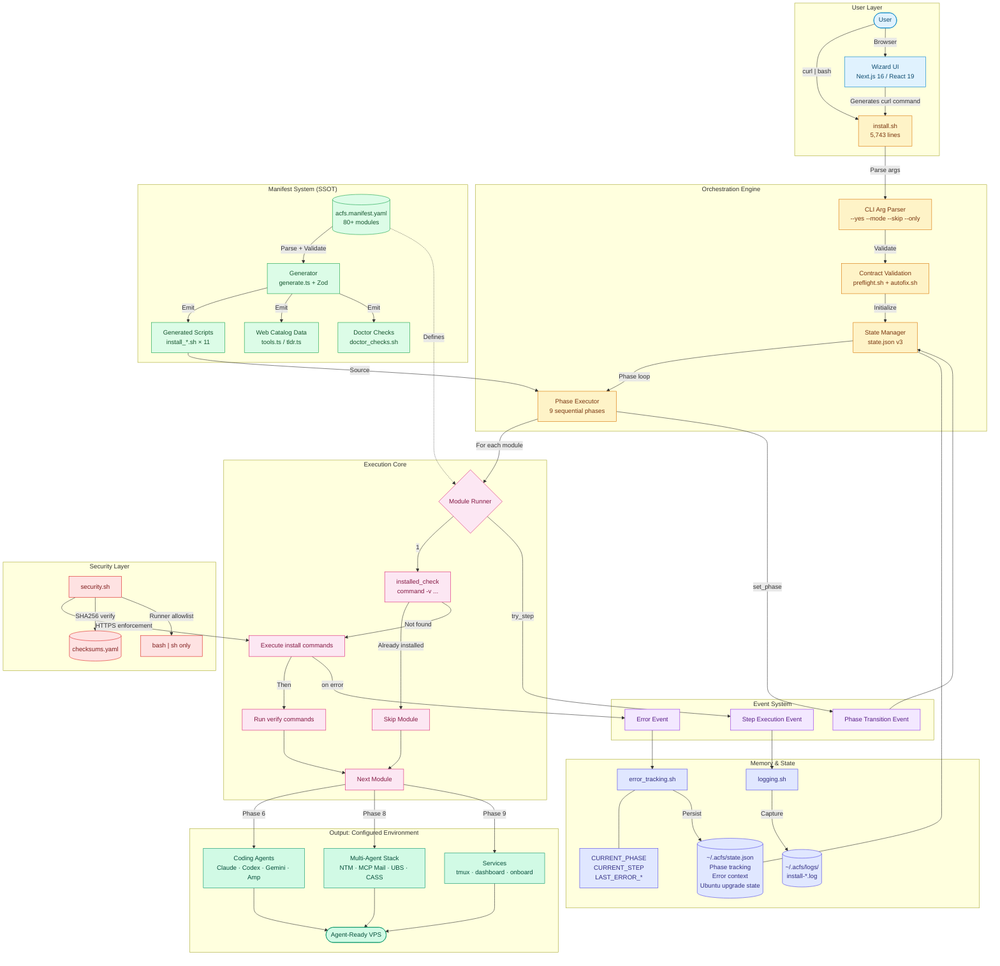
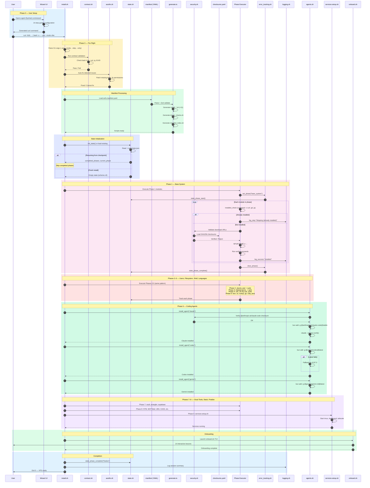
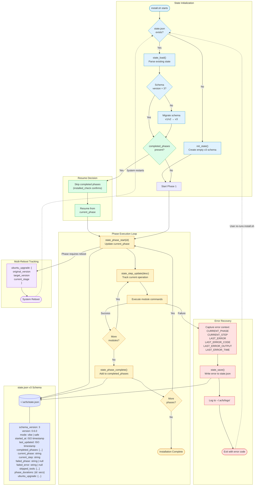
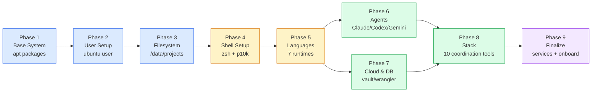

# ACFS Architecture Flow & System Diagrams

> Agentic Coding Flywheel Setup — from a single `curl` command to a fully operational multi-agent development environment.

---

## 1. High-Level Architecture Flow



---

## 2. Detailed Sequence Diagram



---

## 3. Component Interaction Matrix

| Component | install.sh | state.sh | error_tracking | logging | security | manifest | generate.ts | agents.sh | services | onboard | Wizard UI |
|---|:-:|:-:|:-:|:-:|:-:|:-:|:-:|:-:|:-:|:-:|:-:|
| **install.sh** | — | R/W | R/W | W | R | R | — | Call | Call | Call | — |
| **state.sh** | Called | — | W | — | — | — | — | — | — | — | — |
| **error_tracking.sh** | Called | W | — | W | — | — | — | — | — | — | — |
| **logging.sh** | Called | — | — | — | — | — | — | — | — | — | — |
| **security.sh** | Called | — | — | W | — | — | — | — | — | — | — |
| **acfs.manifest.yaml** | R | — | — | — | — | — | R | — | — | — | — |
| **generate.ts** | — | — | — | — | — | R | — | — | — | — | W |
| **agents.sh** | Called | — | — | W | R | — | — | — | — | — | — |
| **services-setup.sh** | Called | — | — | W | — | — | — | — | — | — | — |
| **onboard.sh** | Called | R | — | — | — | — | — | — | — | — | — |
| **Wizard UI** | Generates cmd | — | — | — | — | — | R (data) | — | — | — | — |
| **contract.sh** | Called | — | — | W | — | — | — | — | — | — | — |
| **autofix.sh** | Called | — | — | W | — | — | — | — | — | — | — |
| **checksums.yaml** | — | — | — | — | R | — | — | — | — | — | — |
| **doctor.sh** | — | R | — | W | — | R | — | — | — | — | — |

**Legend:** R = Reads from, W = Writes to, R/W = Both, Call = Invokes, Called = Invoked by, — = No interaction

---

## 4. Data Transformations

Shows how a short user prompt transforms through the system into a fully configured environment.

```
┌─────────────────────────────────────────────────────────────────────────┐
│ INPUT                                                                    │
│                                                                          │
│   curl -fsSL https://agent-flywheel.com/install?ref=main | \            │
│     bash -s -- --yes --mode vibe                                         │
│                                                                          │
│   Characters: ~80    Tokens: ~20                                         │
└────────────────────────────────────┬────────────────────────────────────┘
                                     │
                                     ▼
┌─────────────────────────────────────────────────────────────────────────┐
│ MANIFEST EXPANSION                                                       │
│                                                                          │
│   acfs.manifest.yaml                                                     │
│   ├── 80+ module definitions                                            │
│   ├── 9 execution phases                                                │
│   ├── Dependency graph across modules                                   │
│   ├── Web metadata for each tool                                        │
│   └── Verification commands per module                                  │
│                                                                          │
│   Lines: ~1,500    Size: 75 KB                                           │
└────────────────────────────────────┬────────────────────────────────────┘
                                     │
                                     ▼
┌─────────────────────────────────────────────────────────────────────────┐
│ CODE GENERATION                                                          │
│                                                                          │
│   generate.ts (58 KB) transforms manifest into:                          │
│   ├── 11 category install scripts (install_*.sh)                        │
│   ├── doctor_checks.sh (health verification)                            │
│   ├── manifest_index.sh (bash data arrays)                              │
│   └── Web catalog TypeScript files                                      │
│                                                                          │
│   Total generated output: ~5,000+ lines of bash                         │
└────────────────────────────────────┬────────────────────────────────────┘
                                     │
                                     ▼
┌─────────────────────────────────────────────────────────────────────────┐
│ ORCHESTRATION                                                            │
│                                                                          │
│   install.sh (5,743 lines) + 50+ library scripts:                        │
│   ├── logging.sh         — output + log capture                         │
│   ├── state.sh           — phase tracking (state.json v3)               │
│   ├── error_tracking.sh  — error context capture                        │
│   ├── security.sh        — HTTPS + checksum verification                │
│   ├── install_helpers.sh — execution context routing                    │
│   ├── agents.sh          — Claude/Codex/Gemini install                  │
│   ├── doctor.sh          — 96 KB health checks                          │
│   ├── update.sh          — 80 KB update orchestration                   │
│   ├── sandbox.sh         — LXD container setup                          │
│   └── 40+ more libraries                                               │
│                                                                          │
│   Total library code: ~300 KB+ across 50+ files                          │
└────────────────────────────────────┬────────────────────────────────────┘
                                     │
                                     ▼
┌─────────────────────────────────────────────────────────────────────────┐
│ SYSTEM TRANSFORMATION                                                    │
│                                                                          │
│   Fresh Ubuntu VPS → Agent-Ready Dev Environment                         │
│                                                                          │
│   ├── 60+ packages installed via apt                                    │
│   ├── 7 language runtimes (bun, uv/python, rust, go, ruby, java, php)  │
│   ├── 4 AI coding agents (Claude, Codex, Gemini, Amp)                  │
│   ├── 10 multi-agent coordination tools                                 │
│   ├── Shell environment (zsh + oh-my-zsh + powerlevel10k)              │
│   ├── Cloud tools (vault, wrangler, supabase, vercel)                  │
│   ├── Developer utilities (tmux, lazygit, ripgrep, fzf, gh)           │
│   ├── Configuration files (~20 dotfiles/configs)                        │
│   └── Running services (tmux, dashboard, tailscale)                    │
│                                                                          │
│   Files created/modified: 500+                                           │
│   Total disk footprint: ~2-4 GB                                          │
└─────────────────────────────────────────────────────────────────────────┘
```

---

## 5. Memory & Context Flow

How the state manager handles phase tracking, error context, and resumability during a long-running installation.



### Context Budget Management

| Context Layer | Storage Location | Size Limit | Eviction Strategy |
|---|---|---|---|
| **Phase state** | `~/.acfs/state.json` | ~2 KB | Overwrite on each save |
| **Error context** | Shell variables + state.json | 2,000 chars (stderr) | Truncate LAST_ERROR_OUTPUT |
| **Install logs** | `~/.acfs/logs/install-*.log` | Unbounded (append) | One file per session |
| **Agent memory** | `~/.claude/memory/` | Per-topic JSON files | Manual pruning |
| **Session archive** | `~/.acfs/cass/` | Per-session records | Indexed by date |
| **Message archive** | `.mcp-mail/` in project | Per-thread JSON | Thread-based retention |

---

## 6. Event Timeline

Chronological view of all events emitted during a typical full installation.

```
Time    Event                          Source              State Change
─────── ────────────────────────────── ─────────────────── ──────────────────────────
T+0s    INSTALL_START                  install.sh          mode=vibe, started_at=now
T+1s    CONTRACT_VALIDATE              contract.sh         Checking bash, curl, jq
T+2s    CONTRACT_PASS                  contract.sh         Pre-flight OK
T+3s    AUTOFIX_RUN                    autofix.sh          Patching detected issues
T+5s    STATE_INIT                     state.sh            state.json created (v3)
│
T+6s    PHASE_START: base_system       error_tracking.sh   current_phase=base_system
T+7s    STEP: "Installing curl"        error_tracking.sh   current_step updated
T+8s    INSTALLED_CHECK_PASS: curl     Phase Executor      Skip (already present)
T+9s    STEP: "Installing git"         error_tracking.sh   current_step updated
T+10s   INSTALLED_CHECK_PASS: git      Phase Executor      Skip (already present)
T+15s   STEP: "Installing jq"          error_tracking.sh   current_step updated
T+45s   INSTALL_COMPLETE: base pkgs    Phase Executor      apt-get finished
T+46s   VERIFY_PASS: curl, git, jq     Phase Executor      All verify commands pass
T+47s   PHASE_COMPLETE: base_system    state.sh            completed_phases += base_system
│
T+48s   PHASE_START: user_setup        error_tracking.sh   current_phase=user_setup
T+50s   STEP: "Configure ubuntu user"  error_tracking.sh   Manual/orchestration step
T+55s   PHASE_COMPLETE: user_setup     state.sh            completed_phases += user_setup
│
T+56s   PHASE_START: filesystem        error_tracking.sh   current_phase=filesystem
T+57s   STEP: "Create /data/projects"  error_tracking.sh   mkdir + chown
T+60s   STEP: "Create ~/.acfs"         error_tracking.sh   Config directory
T+65s   PHASE_COMPLETE: filesystem     state.sh            completed_phases += filesystem
│
T+66s   PHASE_START: shell_setup       error_tracking.sh   current_phase=shell_setup
T+70s   SECURITY_VERIFY: oh-my-zsh    security.sh         SHA256 checksum OK
T+90s   STEP: "Install oh-my-zsh"      error_tracking.sh   Verified installer pipe
T+100s  STEP: "Install powerlevel10k"  error_tracking.sh   Git clone + config
T+110s  PHASE_COMPLETE: shell_setup    state.sh            completed_phases += shell_setup
│
T+111s  PHASE_START: languages         error_tracking.sh   current_phase=languages
T+115s  SECURITY_VERIFY: bun           security.sh         SHA256 checksum OK
T+120s  STEP: "Install bun"            error_tracking.sh   curl | bash verified
T+135s  STEP: "Install uv + Python"    error_tracking.sh   Verified installer
T+160s  STEP: "Install rustup"         error_tracking.sh   curl | sh verified
T+190s  STEP: "Install Go"             error_tracking.sh   Binary download
T+210s  STEP: "Install Ruby (rbenv)"   error_tracking.sh   Git clone + build
T+240s  STEP: "Install Java (SDKMAN)"  error_tracking.sh   Verified installer
T+260s  VERIFY_PASS: all runtimes      Phase Executor      bun, python, cargo, go, ruby
T+261s  PHASE_COMPLETE: languages      state.sh            completed_phases += languages
│
T+262s  PHASE_START: agents            error_tracking.sh   current_phase=agents
T+265s  STEP: "Install Claude Code"    error_tracking.sh   bun add -g
T+280s  VERIFY_PASS: claude            agents.sh           claude --version OK
T+285s  STEP: "Install Codex"          error_tracking.sh   bun add -g
T+300s  VERIFY_PASS: codex             agents.sh           codex --version OK
T+305s  STEP: "Install Gemini"         error_tracking.sh   bun add -g
T+315s  VERIFY_PASS: gemini            agents.sh           gemini --version OK
T+316s  PHASE_COMPLETE: agents         state.sh            completed_phases += agents
│
T+317s  PHASE_START: cloud_db          error_tracking.sh   current_phase=cloud_db
T+320s  STEP: "Install Vault"          error_tracking.sh   Binary download + verify
T+340s  STEP: "Install Wrangler"       error_tracking.sh   bun add -g
T+355s  STEP: "Install Supabase CLI"   error_tracking.sh   bun add -g
T+370s  PHASE_COMPLETE: cloud_db       state.sh            completed_phases += cloud_db
│
T+371s  PHASE_START: stack             error_tracking.sh   current_phase=stack
T+375s  STEP: "Install NTM"            error_tracking.sh   Verified installer
T+400s  STEP: "Install MCP Agent Mail" error_tracking.sh   Verified installer
T+420s  STEP: "Install UBS"            error_tracking.sh   Verified installer
T+440s  STEP: "Install CASS"           error_tracking.sh   Verified installer
T+500s  PHASE_COMPLETE: stack          state.sh            completed_phases += stack
│
T+501s  PHASE_START: finalize          error_tracking.sh   current_phase=finalize
T+505s  SERVICE_START: tmux            services-setup.sh   Session created
T+510s  SERVICE_START: dashboard       services-setup.sh   localhost:38080
T+520s  ONBOARD_LAUNCH                 onboard.sh          TUI starts (14 lessons)
T+900s  ONBOARD_COMPLETE               onboard.sh          All lessons done
T+901s  PHASE_COMPLETE: finalize       state.sh            completed_phases += finalize
│
T+902s  INSTALL_COMPLETE               install.sh          Exit 0 — VPS ready
```

### Event Category Summary

| Category | Count | Examples |
|---|---|---|
| Phase transitions | 18 | `PHASE_START`, `PHASE_COMPLETE` (×9 phases) |
| Step updates | 40–60 | `STEP: "Installing X"` per module |
| Security verifications | 10–15 | `SECURITY_VERIFY: tool` per verified installer |
| Installed checks | 80+ | `INSTALLED_CHECK_PASS/FAIL` per module |
| Verify passes | 80+ | `VERIFY_PASS: tool` per module |
| Service starts | 3–5 | `SERVICE_START: tmux, dashboard` |
| Error events | 0–5 | `ERROR: phase/step` (on failure only) |
| **Total events** | **~230–250** | **Per full installation run** |

---

## 7. Estimated Metrics

### Installation Run Metrics

| Metric | Value | Notes |
|---|---|---|
| **Total install time** | 15–30 min | VPS with good bandwidth |
| **Manifest modules** | 80+ | Across 9 phases |
| **Bash lines executed** | ~10,000+ | install.sh + libraries + generated scripts |
| **Library scripts sourced** | 50+ | From `scripts/lib/` |
| **Generated scripts** | 11 | Category installers from manifest |
| **apt packages** | 60+ | Phase 1 base system |
| **Language runtimes** | 7 | bun, python, rust, go, ruby, java, php |
| **AI agents installed** | 4 | Claude, Codex, Gemini, Amp |
| **Coordination tools** | 10 | NTM, MCP Mail, UBS, CASS, etc. |
| **Config files created** | ~20 | Dotfiles, agent configs, shell configs |
| **Network requests** | 50–80 | Package downloads, git clones, apt fetches |
| **SHA256 verifications** | 10–15 | Per verified installer |
| **Disk usage** | 2–4 GB | All tools + runtimes + caches |
| **state.json writes** | ~20 | Phase start/complete + error saves |
| **Log file size** | 500 KB – 2 MB | Per installation session |

### Codebase Metrics

| Metric | Value | Notes |
|---|---|---|
| **install.sh** | 5,743 lines | Main orchestrator |
| **Library scripts** | ~300 KB total | 50+ files in `scripts/lib/` |
| **Manifest** | ~1,500 lines (75 KB) | Single source of truth |
| **Generator** | 58 KB | `generate.ts` (TypeScript) |
| **Web app** | 1,000+ TS lines | Next.js 16 wizard |
| **Onboard TUI** | 50 KB | Compiled shell script |
| **Doctor checks** | 96 KB | Health verification |
| **Update orchestrator** | 80 KB | Update management |
| **Total codebase** | ~1 MB+ | Bash + TypeScript + YAML + Markdown |

### Manifest Generator Throughput

| Input | Output | Ratio |
|---|---|---|
| 1 module definition (~20 lines YAML) | ~50 lines bash + ~30 lines TypeScript | 1:4 |
| 80 modules (1,500 lines YAML) | ~5,000 lines bash + ~2,000 lines TS | 1:4.7 |
| 1 `verified_installer` block | ~15 lines secure bash (checksum + pipe) | 1:5 |
| Full manifest | 11 install scripts + doctor + index + web data | 1 file → 15+ files |

### Agent Coordination Metrics (Post-Install)

| Metric | Value | Notes |
|---|---|---|
| **MCP Mail message size** | ~0.5–2 KB each | JSON with thread_id, body, metadata |
| **File reservation TTL** | 3,600s default | Per-agent file locks |
| **Session archive search** | <1s per query | CASS indexed by agent + date |
| **Agent memory entries** | 10–100 per project | CM topic-based JSON |
| **Concurrent agents** | 2–4 typical | Claude + Codex + Gemini in parallel |

---

## Appendix: Phase Dependency Graph


